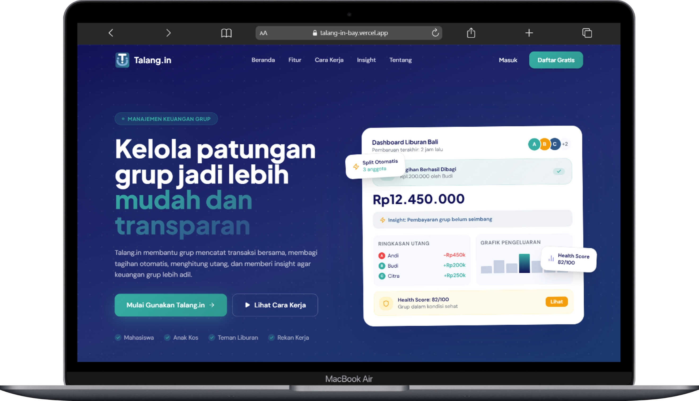
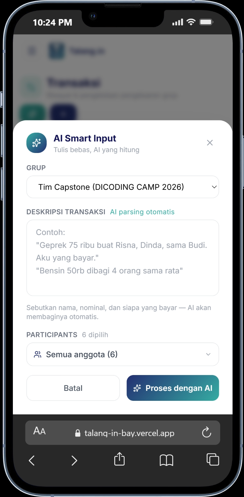
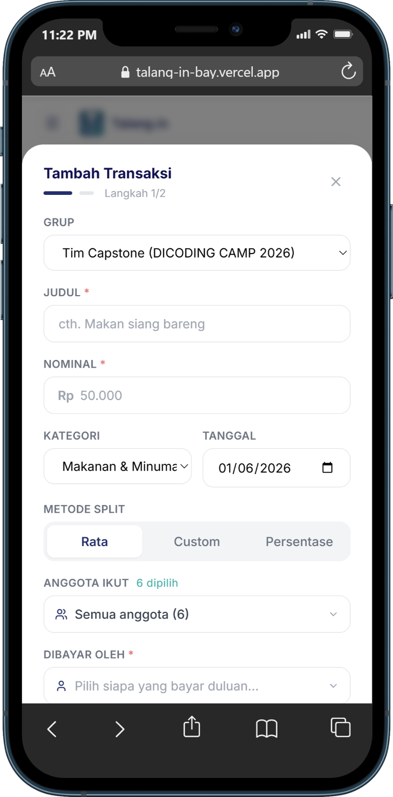

# Talang.in 💸

### *Kelola patungan grup jadi lebih mudah dan transparan*

---

## 🔗 Quick Access

| Platform                  | Link                                         |
| ------------------------- | -------------------------------------------- |
| 🌐 Web Application        | https://talang-in-bay.vercel.app             |
| 📊 Data Science Dashboard | https://talangin-data-science.streamlit.app/ |
| 👤 Register Account       | https://talang-in-bay.vercel.app/register    |

---

## 🤔 What — Apa itu Talang.in?

**Talang.in** adalah aplikasi manajemen keuangan bersama yang membantu kamu dan grupmu mencatat pengeluaran bersama, membagi tagihan secara otomatis, dan melunasi utang dengan cara yang paling efisien — semua dalam satu tempat.

Nggak perlu lagi repot ngitung manual di notes HP atau awkward nagih teman lewat chat.

---

## 😩 Why — Kenapa perlu Talang.in?

Situasi ini pasti familiar:

* 🍜 Habis makan bareng, bingung siapa hutang berapa ke siapa
* 💸 Udah nagih teman tapi lupa siapa yang belum bayar
* 🧮 Pusing ngitung rantai utang yang makin panjang dan ruwet
* 📱 Catatan keuangan grup berserakan di berbagai chat & grup WA

Talang.in hadir untuk menyelesaikan semua itu — **transparan, rapi, dan adil untuk semua anggota grup.**

---

## 👥 Who — Siapa yang cocok pakai ini?

Talang.in cocok buat kamu yang sering patungan bareng orang lain:

| Siapa             | Contoh Penggunaan                                 |
| ----------------- | ------------------------------------------------- |
| 🎓 Mahasiswa      | Patungan biaya kost, makan bareng, tugas kelompok |
| 🏠 Anak Kos       | Beli kebutuhan dapur bareng teman satu kos        |
| ✈️ Teman Liburan  | Mengelola keuangan perjalanan bersama             |
| 💼 Rekan Kerja    | Patungan makan siang dan kebutuhan tim            |
| 👨‍👩‍👧 Keluarga | Mengelola pengeluaran rumah tangga bersama        |

---

## 📍 Where — Di mana bisa diakses?

Talang.in merupakan aplikasi berbasis web yang dapat diakses langsung melalui browser tanpa perlu melakukan instalasi.

### 🌐 Web Application

https://talang-in-bay.vercel.app

### 📊 Data Science Dashboard

https://talangin-data-science.streamlit.app/

Dashboard analytics memberikan visualisasi data dan insight terkait aktivitas keuangan grup secara real-time.

---

## ⏰ When — Kapan Talang.in berguna?

Gunakan Talang.in setiap kali ada pengeluaran bersama:

* Saat liburan bersama
* Setelah makan bersama
* Saat mengelola biaya kos
* Ketika mengadakan kegiatan organisasi
* Untuk memantau kondisi keuangan grup secara berkala

---

## ⚡ How — Bagaimana cara kerjanya?

### 1️⃣ Buat Grup

Buat grup sesuai kebutuhan, misalnya:

* Liburan Bali
* Anak Kos A3
* Tugas Kelompok
* Keluarga

### 2️⃣ Catat Transaksi

Talang.in menyediakan dua metode input:

#### 🤖 AI Smart Input

Masukkan transaksi menggunakan bahasa alami.

Contoh:

> "Geprek 75 ribu buat Risna, Dinda, dan Budi. Aku yang bayar."

AI akan otomatis:

* Mengenali nominal
* Menentukan siapa yang membayar
* Membagi tagihan secara otomatis
* Menyimpan transaksi

#### ✍️ Manual Input

Bagi pengguna yang ingin memasukkan data secara manual.

### 3️⃣ Simplify Debt

Talang.in akan menyederhanakan rantai utang menjadi jumlah transaksi minimum sehingga proses pelunasan lebih mudah.

---

## 🚀 Fitur Utama

| Fitur                    | Deskripsi                                      |
| ------------------------ | ---------------------------------------------- |
| 🤖 AI Smart Input        | Input transaksi menggunakan bahasa sehari-hari |
| 👥 Group Management      | Mengelola banyak grup sekaligus                |
| 💰 Balance Tracking      | Memantau saldo dan utang anggota               |
| 🔀 Simplify Debt         | Menyederhanakan transaksi pelunasan            |
| 📊 Dashboard             | Ringkasan kondisi keuangan grup                |
| 🔔 Reminder              | Pengingat pembayaran utang                     |
| 📈 Analytics             | Insight dan statistik pengeluaran              |
| 🔒 Secure Authentication | Login dan keamanan akun pengguna               |

---

## 📊 Dashboard Data Science & Analytics

Selain aplikasi utama, Talang.in juga dilengkapi dengan Dashboard Data Science yang membantu pengguna memahami pola pengeluaran melalui visualisasi data interaktif.

### 🌐 Dashboard Analytics

https://talangin-data-science.streamlit.app/

### 🎯 Tujuan Dashboard

Dashboard ini dikembangkan untuk:

* Menganalisis pola pengeluaran pengguna
* Memberikan insight keuangan grup
* Mengidentifikasi kategori pengeluaran terbesar
* Mendukung pengambilan keputusan berbasis data

### 📈 Fitur Dashboard

| Fitur Analytics          | Deskripsi                                 |
| ------------------------ | ----------------------------------------- |
| 📊 Expense Analysis      | Analisis pengeluaran berdasarkan kategori |
| 📅 Monthly Trend         | Tren pengeluaran bulanan                  |
| 👥 Member Contribution   | Kontribusi setiap anggota grup            |
| 💰 Spending Distribution | Distribusi pengeluaran                    |
| 📈 Financial Insights    | Insight otomatis dari data transaksi      |
| 🎯 Health Score          | Evaluasi kondisi keuangan grup            |

### 🛠️ Teknologi Dashboard

* Python
* Streamlit
* Pandas
* NumPy
* Plotly
* Data Analytics
* Machine Learning Support

---

## 🏗️ Tech Stack

### Frontend

* Next.js
* React.js
* Tailwind CSS

### Backend

* Supabase
* PostgreSQL

### Artificial Intelligence

* Google Gemini API
* Natural Language Processing

### Data Science

* Python
* Streamlit
* Pandas
* Plotly
* NumPy

### Deployment

* Vercel
* Streamlit Cloud

---

## 🎯 Manfaat Talang.in

✅ Mengurangi konflik akibat patungan

✅ Transparansi keuangan grup

✅ Mempermudah pencatatan transaksi

✅ Menghemat waktu perhitungan

✅ Insight keuangan berbasis data

✅ Pelunasan utang lebih efisien

---

## 📷 Preview Aplikasi

### Landing Page

### AI Smart Input

### Manual Input

---

## 🌟 Visi Kami

Talang.in hadir untuk membantu masyarakat mengelola keuangan bersama secara lebih transparan, efisien, dan berbasis data.

Dengan menggabungkan teknologi Artificial Intelligence dan Data Science, Talang.in tidak hanya mencatat transaksi, tetapi juga memberikan insight yang membantu pengguna mengambil keputusan finansial yang lebih baik.

---

### 🚀 Coba Talang.in Sekarang

🌐 https://talang-in-bay.vercel.app

📊 https://talangin-data-science.streamlit.app/

💸 *Karena patungan seharusnya tidak ribet.*

