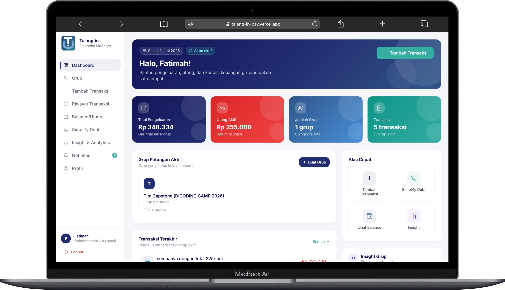
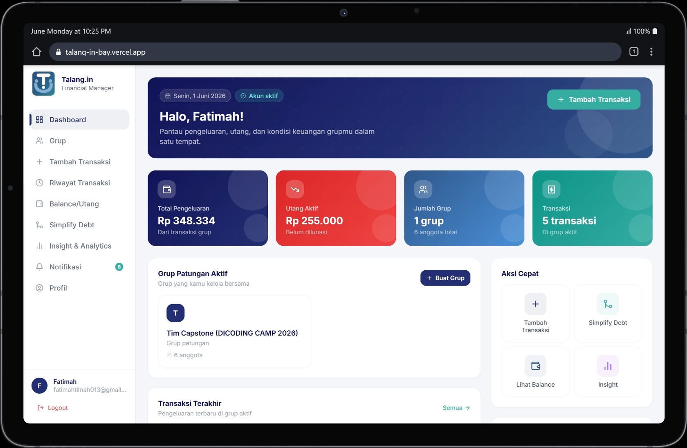
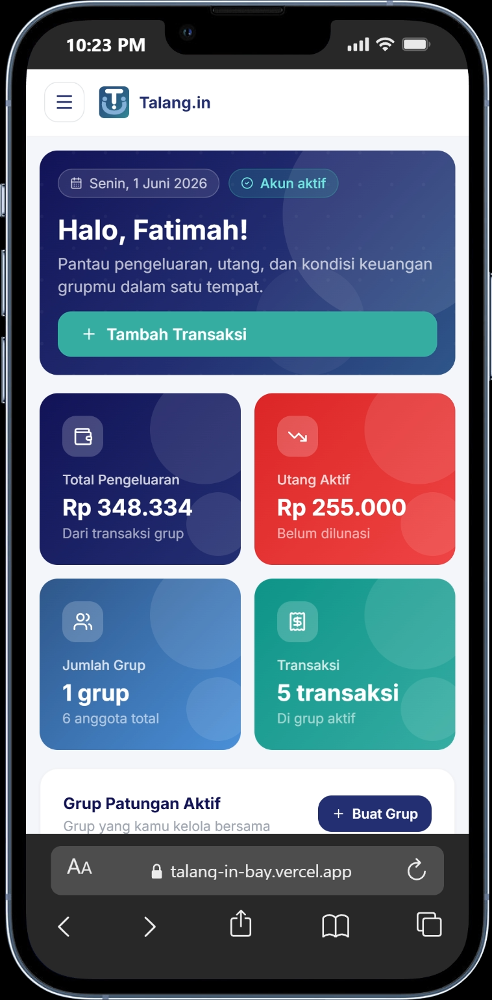

<div align="center">


# Talang.in 💸

### *Kelola patungan grup jadi lebih mudah dan transparan*


</div>

---

## 🤔 What — Apa itu Talang.in?

**Talang.in** adalah aplikasi manajemen keuangan bersama yang membantu kamu dan grupmu mencatat pengeluaran bersama, membagi tagihan secara otomatis, dan melunasi utang dengan cara yang paling efisien — semua dalam satu tempat.

Nggak perlu lagi repot ngitung manual di notes HP atau awkward nagih teman lewat chat.

---

## 😩 Why — Kenapa perlu Talang.in?

Situasi ini pasti familiar:

- 🍜 Habis makan bareng, bingung siapa hutang berapa ke siapa
- 💸 Udah nagih teman tapi lupa siapa yang belum bayar
- 🧮 Pusing ngitung rantai utang yang makin panjang dan ruwet
- 📱 Catatan keuangan grup berserakan di berbagai chat & grup WA

Talang.in hadir untuk menyelesaikan semua itu — **transparan, rapi, dan adil untuk semua anggota grup.**

---

## 👥 Who — Siapa yang cocok pakai ini?

Talang.in cocok buat kamu yang sering patungan bareng orang lain:

| Siapa | Contoh Penggunaan |
|---|---|
| 🎓 **Mahasiswa** | Patungan biaya kost, makan bareng, tugas kelompok |
| 🏠 **Anak Kos** | Beli kebutuhan dapur bareng teman satu kos |
| ✈️ **Teman Liburan** | Urus keuangan trip bareng yang transparan |
| 💼 **Rekan Kerja** | Patungan makan siang, kado ulang tahun tim |
| 👨‍👩‍👧 **Keluarga** | Kelola pengeluaran rumah tangga bersama |

---

## 📍 Where — Di mana bisa diakses?

Talang.in adalah **web app** yang bisa dibuka langsung dari browser — tanpa perlu install apapun.

> 🌐 **[talang-in-bay.vercel.app](https://talang-in-bay.vercel.app)**

Tersedia dan responsif di semua perangkat:

| Desktop | Tablet | Mobile |
|:---:|:---:|:---:|
|  |  |  |

---

## ⏰ When — Kapan Talang.in berguna?

Gunakan Talang.in setiap kali ada pengeluaran bersama — sebelum, saat, atau setelah patungan terjadi:

- **Saat liburan bareng** → catat semua pengeluaran trip secara real-time
- **Setelah makan bareng** → langsung split tagihan dalam hitungan detik
- **Akhir bulan** → cek siapa yang masih punya utang sebelum tutup buku
- **Kapan saja** → pantau kondisi keuangan grup dari dashboard

---

## ⚡ How — Bagaimana cara kerjanya?

Cukup **3 langkah** untuk mulai:

**1️⃣ Buat Grup** → Undang teman-temanmu ke dalam grup patungan

**2️⃣ Catat Transaksi** → Ketik dalam bahasa natural, AI yang hitung & bagi otomatis

> *"Geprek 75 ribu buat Risna, Dinda, sama Budi. Aku yang bayar."*
> → AI langsung parsing siapa bayar berapa 🤖

**3️⃣ Lunasi dengan Simplify Debt** → Talang.in menyederhanakan rantai utang jadi transaksi paling minimal

---

### 🔍 Fitur Lengkap


| Fitur | Keterangan |
|---|---|
| 🤖 **AI Smart Input** | Input transaksi pakai bahasa sehari-hari, AI yang hitung |
| 📊 **Dashboard** | Ringkasan keuangan grup dalam satu tampilan |
| 👥 **Grup** | Kelola banyak grup patungan sekaligus |
| 💰 **Balance & Utang** | Lihat siapa hutang berapa ke siapa secara real-time |
| 🔀 **Simplify Debt** | Kurangi jumlah transaksi pembayaran jadi seminimal mungkin |
| 📈 **Insight & Analytics** | Grafik pengeluaran & health score keuangan grupmu |
| 🔔 **Notifikasi** | Pengingat tagihan yang belum dilunasi |

<div align="center">
  
  &nbsp;&nbsp;
  
</div>

---

## 🧰 Tech Stack
 
| Layer | Teknologi |
|---|---|
| **Frontend** | React, Vite, Tailwind CSS |
| **Backend** | Node.js, Express.js |
| **Database** | Supabase (PostgreSQL) |
| **AI / NLP** | Custom NER Model (Python) |
| **Deployment** | Vercel (frontend) + Railway (backend) |
| **Data Science** | Python, Streamlit |
 
---
 
## 🛠️ Installation & Setup
 
### Prerequisites
 
Pastikan kamu sudah menginstall:
 
- [Node.js](https://nodejs.org/) v18+
- npm atau yarn
- [Git](https://git-scm.com/)
### 1. Clone Repository
 
```bash
git clone https://github.com/<username>/talang-in.git
cd talang-in
```
 
### 2. Setup Frontend
 
```bash
cd frontend
npm install
cp .env.example .env
```
 
Edit file `.env` dan isi variabel yang dibutuhkan (lihat [Environment Variables](#️-environment-variables)), lalu jalankan:
 
```bash
npm run dev
```
 
Frontend akan berjalan di `http://localhost:5173`
 
### 3. Setup Backend
 
```bash
cd ../backend
npm install
cp .env.example .env
```
 
Edit file `.env` dan isi variabel yang dibutuhkan, lalu jalankan:
 
```bash
npm run dev
```
 
Backend akan berjalan di `http://localhost:3000`
 
---
 
## ⚙️ Environment Variables
 
### Frontend (`frontend/.env`)
 
| Variable | Keterangan | Contoh |
|---|---|---|
| `VITE_API_BASE_URL` | URL backend API | `http://localhost:3000` |
 
### Backend (`backend/.env`)
 
| Variable | Keterangan | Contoh |
|---|---|---|
| `SUPABASE_URL` | URL project Supabase | `https://xxxx.supabase.co` |
| `SUPABASE_KEY` | API Key Supabase (anon/service) | `eyJhbGci...` |
| `FRONTEND_URL` | URL frontend untuk konfigurasi CORS | `http://localhost:5173` |
| `PORT` | Port yang digunakan backend | `3000` |
 
> 💡 Untuk mendapatkan `SUPABASE_URL` dan `SUPABASE_KEY`, buat project baru di [supabase.com](https://supabase.com) dan ambil dari menu **Settings → API**.

<div align="center">

**Udah penasaran? Langsung cobain gratis! 👇**

(https://talang-in-bay.vercel.app/register)

---
---

---

## 🔬 Data Science Dashboard

Talang.in dilengkapi **Data Science Dashboard v4.0** berbasis Streamlit yang mendokumentasikan seluruh proses sains data di balik fitur **AI Smart Transaction Input** — mulai dari persiapan data hingga evaluasi model NLP.

> 🧪 **[talangin-data-science.streamlit.app](https://talangin-data-science.streamlit.app/)**

Dashboard ini menjelaskan bagaimana AI Talang.in bisa memahami kalimat seperti:

> *"Geprek 75 ribu buat Risna, Dinda, sama Budi"*
> → **PERSON:** Risna, Dinda, Budi | **ITEM:** Geprek | **PRICE:** 75k

### 📋 Isi Dashboard

| Halaman | Keterangan |
|---|---|
| 🟢 **Overview** | Penjelasan project Talang.in, tujuan dashboard, dan alur data |
| 📦 **Data Source** | Asal-usul dan struktur dataset yang digunakan |
| 🧹 **Data Cleaning** | Proses pembersihan dan normalisasi data transaksi |
| 📊 **EDA Data Utama** | Exploratory Data Analysis — distribusi, pola, dan statistik data |
| 💡 **Insight Data** | Temuan menarik dari analisis data transaksi |
| 🏷️ **NER Dataset** | Dataset Named Entity Recognition untuk melatih model AI |
| 🧪 **A/B Testing** | Pengujian performa model AI dalam mengenali entitas transaksi |
| ✅ **Kesimpulan** | Ringkasan hasil dan rekomendasi pengembangan ke depan |

Dashboard ini dibangun dengan **Python + Streamlit** sebagai dokumentasi ilmiah dan teknis dari pipeline NLP yang menggerakkan fitur AI Talang.in.

*Talang.in — karena patungan harusnya nggak ribet.*

</div> 
