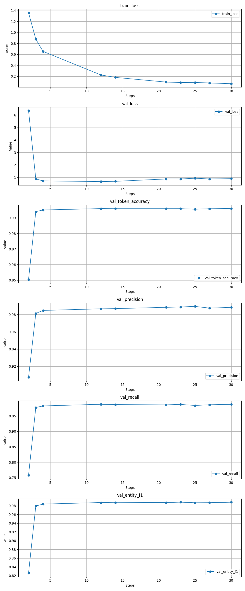

# 28k Dataset Evaluation & Training Metrics

This section highlights the final performance and training progression of the model on the 28k dataset. 

### Final Evaluation Results
The model achieved strong performance on the test dataset:
- **Token Accuracy:** 99.61%
- **Precision:** 98.77%
- **Recall:** 98.65%
- **Entity F1 Score:** 98.71%
- **Loss:** 0.7626

### Training Metrics Visualization
The following charts illustrate the model's metrics across training steps, capturing both training/validation loss and key validation metrics:



---

# Usage Guide
## Build Dataset
```python
# usage example: how to plug this into the training pipeline
from src.preprocessing.preprocess import DatasetBuilder

# init the builder with our chosen hyperparameters
# keep max_len at 100 based 95th percentile analysis in 01_eda.ipynb
# build from the fixed dataset — vocabs are built strictly on train split
builder = DatasetBuilder(
    max_len=100,
    max_word_len=15,
    min_word_freq=2,   # words appearing < 2 times in train -> [UNK]
    train_pct=0.8,
    val_pct=0.1,
    seed=42,
    verbose=True,
)

train_ds, val_ds, test_ds = builder.build_from_file(
    '../data/dataset_fixed.json',
    batch_size=32,
)
```

## How to Save Vocabulary
must be saved since vocabs are used in inference later.

```python
# save vocabs
Path('../data/processed').mkdir(parents=True, exist_ok=True)

builder.save_vocabs('../data/processed/')

for f in Path('../data/processed').iterdir():
    print(f.name, '—', f.stat().st_size, 'bytes')
```

## How to Load Vocabulary

```python
with open('../data/processed/word2idx.json', encoding='utf-8') as f:
    word2idx = json.load(f)
with open('../data/processed/char2idx.json', encoding='utf-8') as f:
    char2idx = json.load(f)
with open('../data/processed/tag2idx.json', encoding='utf-8') as f:
    tag2idx = json.load(f)
    
idx2tag = {v: k for k, v in tag2idx.items()}
```

## Hyperparameter Example

```python
# hyperparams
VOCAB_SIZE     = len(word2idx)       # word vocab
CHAR_VOCAB     = len(char2idx)       # character vocab
NUM_TAGS       = len(tag2idx)        # output classes (BIO tags + PAD)
MAX_LEN        = 100                 # max tokens per sequence
MAX_WORD_LEN   = 15                  # max chars per token

WORD_EMBED_DIM = 128                 # word embedding size
CHAR_EMBED_DIM = 32                  # char embedding size (input to CNN)
CHAR_CNN_DIM   = 128                 # char CNN output size (after global max pool)
BILSTM_UNITS   = 256                 # units per direction -> output is 512
DROPOUT        = 0.3
```

## Building Model

```python
from src.models.ner_model import BillNERModel

# create the model
model = BillNERModel(
    vocab_size=VOCAB_SIZE,
    char_vocab=CHAR_VOCAB,
    num_tags=NUM_TAGS,
    word_embed_dim=WORD_EMBED_DIM,
    char_embed_dim=CHAR_EMBED_DIM,
    char_cnn_dim=CHAR_CNN_DIM,
    bilstm_units=BILSTM_UNITS,
    dropout=DROPOUT,
)

# run a dummy batch to natively build all nested layers
dummy_batch = {
    'word_inputs': tf.zeros((1, MAX_LEN), dtype=tf.int32),
    'char_inputs': tf.zeros((1, MAX_LEN, MAX_WORD_LEN), dtype=tf.int32)
}
model(dummy_batch)
model.summary()
```

## Training Example

```python
optimizer = keras.optimizers.Adam(learning_rate=1e-3, clipnorm=5.0)

@tf.function
def train_step(batch_inputs, batch_tags):
    with tf.GradientTape() as tape:
        emissions, mask = model(batch_inputs, training=True)
        loss = model.crf.log_likelihood(
            emissions,
            tf.cast(batch_tags, tf.int32),
            mask,
        )
    grads = tape.gradient(loss, model.trainable_variables)
    optimizer.apply_gradients(zip(grads, model.trainable_variables))
    return loss

@tf.function
def val_step(batch_inputs, batch_tags):
    emissions, mask = model(batch_inputs, training=False)
    loss = model.crf.log_likelihood(
        emissions,
        tf.cast(batch_tags, tf.int32),
        mask,
    )
    return loss

# grab one batch
for batch_inputs, batch_tags in train_ds.take(1):
    print("word_inputs shape :", batch_inputs['word_inputs'].shape)
    print("char_inputs shape :", batch_inputs['char_inputs'].shape)
    print("tags shape        :", batch_tags.shape)

    # forward pass
    emissions, mask = model(batch_inputs, training=False)
    print("emissions shape   :", emissions.shape)   # (batch, max_len, num_tags)
    print("mask shape        :", mask.shape)

    # one training step
    loss = train_step(batch_inputs, batch_tags)
    print(f"loss after 1 step : {loss:.4f}")

    # check no None gradients
    with tf.GradientTape() as tape:
        e, m = model(batch_inputs, training=True)
        l    = model.crf.log_likelihood(e, tf.cast(batch_tags, tf.int32), m)
    grads = tape.gradient(l, model.trainable_variables)
    none_grads = [v.name for v, g in zip(model.trainable_variables, grads) if g is None]
    print(f"none gradients    : {none_grads if none_grads else 'none — all good'}")

    # viterbi decode
    preds = model.decode(batch_inputs)
    print(f"viterbi output    : {preds.shape}")
```

---

# AI Backend API Guide for Fullstack Integration

Bagian ini menjelaskan cara menggunakan backend AI untuk fitur **AI Smart Input Talang.in**.

Frontend tidak menjalankan model AI secara langsung. Model, inference, dan post-processing berjalan di backend AI FastAPI. Frontend hanya perlu memanggil endpoint API.

---

## Run Backend AI Locally

Jalankan backend AI dari root project:

```bash
uvicorn api.main:app --host 0.0.0.0 --port 8000
```

Untuk development dengan auto-reload:

```bash
uvicorn api.main:app --reload
```

Swagger API dapat dibuka di:

```txt
http://127.0.0.1:8000/docs
```

---

## Warm-up Model

Sebelum melakukan testing AI Smart Input, disarankan menjalankan warm-up terlebih dahulu agar model sudah diload ke memory.

```txt
GET http://127.0.0.1:8000/warmup
```

Response:

```json
{
  "status": "success",
  "message": "AI model sudah berhasil di-warm-up"
}
```

---

## Main Endpoint

Endpoint utama untuk AI Smart Input:

```txt
POST /parse-transaction
```

Local URL:

```txt
http://127.0.0.1:8000/parse-transaction
```

---

## Request Body

Frontend mengirim request seperti ini:

```json
{
  "text": "Sinta bayarin roti bakar keju cepek dan matcha latte 35k untuk Dina Rafi Bima",
  "group_members": ["Dina", "Rafi", "Sinta", "Bima"]
}
```

Keterangan:

```txt
text
→ input transaksi bebas dari user

group_members
→ daftar anggota grup aktif dari frontend/database
```

Catatan:

```txt
AI Smart Input sebaiknya digunakan setelah user memilih grup, karena group_members dipakai untuk mencocokkan nama yang muncul di teks dengan anggota grup.
```

---

## Response Body

Contoh response:

```json
{
  "title": "roti bakar keju, matcha latte",
  "amount": 135000,
  "paidBy": "Sinta",
  "category": "Makanan",
  "splitMethod": "itemized",
  "participants": [
    {
      "name": "Sinta",
      "amount": 33750
    },
    {
      "name": "Dina",
      "amount": 33750
    },
    {
      "name": "Rafi",
      "amount": 33750
    },
    {
      "name": "Bima",
      "amount": 33750
    }
  ],
  "items": [
    {
      "name": "roti bakar keju",
      "amount": 100000,
      "members": ["Sinta", "Dina", "Rafi", "Bima"]
    },
    {
      "name": "matcha latte",
      "amount": 35000,
      "members": ["Sinta", "Dina", "Rafi", "Bima"]
    }
  ],
  "status": "success",
  "message": "AI Smart Input berhasil diproses"
}
```

---

## Mapping Response to Frontend Form

Fullstack dapat mapping hasil API ke form transaksi seperti berikut:

```txt
title        → nama transaksi
amount       → total nominal transaksi
paidBy       → pembayar
category     → kategori transaksi
splitMethod  → metode pembagian
participants → daftar peserta dan nominal split
items        → daftar item dan harga
```

---

## Frontend Environment Variable

Untuk local development:

```env
VITE_AI_API_URL=http://127.0.0.1:8000
```

Untuk production:

```env
VITE_AI_API_URL=https://url-backend-ai-production.com
```

Catatan:

```txt
URL production akan diganti dengan URL backend AI FastAPI yang sudah dideploy.
Frontend production tidak boleh memakai http://127.0.0.1:8000.
```

---

## Example Frontend Service

Contoh file:

```txt
src/services/aiSmartInputService.js
```

```js
// URL backend AI diambil dari environment variable.
// Local: http://127.0.0.1:8000
// Production: URL backend AI yang sudah dideploy.
const AI_API_URL = import.meta.env.VITE_AI_API_URL || "http://127.0.0.1:8000";

// Fungsi ini digunakan frontend untuk mengirim teks transaksi ke backend AI.
export const parseSmartTransaction = async ({ text, groupMembers }) => {
  const response = await fetch(`${AI_API_URL}/parse-transaction`, {
    method: "POST",

    // Request dikirim dalam format JSON.
    headers: {
      "Content-Type": "application/json",
    },

    // text berisi input user.
    // group_members berisi daftar anggota grup aktif.
    body: JSON.stringify({
      text,
      group_members: groupMembers,
    }),
  });

  // Jika API gagal, lempar error agar bisa ditangani di UI.
  if (!response.ok) {
    throw new Error("Gagal memproses AI Smart Input");
  }

  // Response berisi data transaksi terstruktur.
  return response.json();
};
```

---

## Example Frontend Flow

```txt
1. User memilih grup
2. Frontend mengambil daftar anggota grup
3. User mengetik transaksi di AI Smart Input
4. Frontend mengirim text + group_members ke backend AI
5. Backend AI mengembalikan hasil transaksi terstruktur
6. Frontend menampilkan preview hasil AI
7. User klik "Gunakan Hasil"
8. Form transaksi otomatis terisi
9. User menyimpan transaksi ke database
```

---

## Performance Notes

Model menggunakan TensorFlow dengan arsitektur BiLSTM + CRF, sehingga inference bisa membutuhkan beberapa detik, terutama jika berjalan di CPU.

Catatan:

```txt
- Gunakan endpoint /warmup sebelum testing atau demo.
- Frontend perlu menampilkan loading state saat AI memproses input.
- Jika backend dideploy di Render Free, request pertama setelah idle bisa lebih lambat karena server dapat sleep.
```

Contoh loading text:

```txt
AI sedang menganalisis transaksi...
```

---

## Production Notes

Untuk production, arsitekturnya adalah:

```txt
Frontend Talang.in di Vercel
        ↓
VITE_AI_API_URL
        ↓
Backend AI FastAPI
        ↓
Model NER + Post-processing
        ↓
Response transaksi
```

Frontend tidak menyimpan atau menjalankan file model AI. Semua file model tetap berada di backend AI.

File penting untuk backend AI:

```txt
models/bill_ner_model.keras
models/best_ner_model.weights.h5
outputs/vocabs/word2idx.json
outputs/vocabs/char2idx.json
outputs/vocabs/tag2idx.json
outputs/training_config.json
```

Jika backend AI sudah dideploy, fullstack cukup mengganti:

```env
VITE_AI_API_URL=http://127.0.0.1:8000
```

menjadi:

```env
VITE_AI_API_URL=https://url-backend-ai-production.com
```